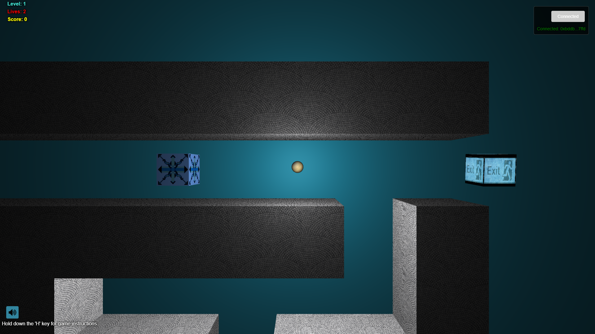
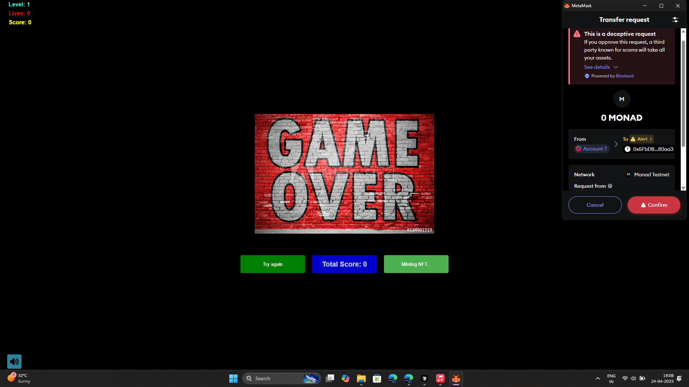

# Ball-Maze with NFT Integration


A maze puzzle game where you control a ball through challenging levels with blockchain integration for NFT minting. This project combines engaging gameplay with Web3 technology.

## 🎮 Game Features

- Ball-Maze gameplay mechanics
- Multiple levels with increasing difficulty
- Control the ball through maze-like environments
- Score tracking and lives system
- Sound effects with mute/unmute functionality
- Modern HTML5 and JavaScript implementation
- Mobile-friendly controls

## 🔗 Blockchain Integration

- Connect your MetaMask wallet
- Mint NFTs based on your game achievements
- Smart contract built on Ethereum using Solidity
- ERC-721 standard implementation

## 🚀 Getting Started

### Prerequisites

- Modern web browser
- MetaMask extension installed
- Test ETH on a supported network (for NFT minting)

### Installation

1. Clone the repository:
   ```
   git clone https://github.com/varshithm7x/Ball-Maze.git
   cd Ball-Maze
   ```

2. Install dependencies:
   ```
   npm install
   ```

3. Configure your smart contract and environment:
   ```
   # Copy the sample configuration files
   cp js/config.sample.js js/config.js
   cp .env.sample .env
   
   # Edit js/config.js and .env to replace placeholders with your actual values
   ```

4. Start the local server:
   ```
   npm start
   ```

5. Open your browser and navigate to:
   ```
   http://localhost:8080
   ```

### Deployment

When deploying to a hosting service like GitHub Pages:

1. Make sure `js/config.js` and `.env` are listed in your `.gitignore` file to prevent them from being committed
2. Manually add the configuration files to your deployment environment
3. For GitHub Pages: create a separate branch or configuration for deployment that includes the configs with non-sensitive data

## 🎯 How to Play

1. Press any key to start the game
2. Use W, A, S, D keys to control the ball:
   - W: Move up
   - A: Move left
   - S: Move down
   - D: Move right
3. Collect points by navigating through the maze
4. Find the exit to advance to the next level
5. Hold H key to view game instructions
6. Connect your MetaMask wallet to enable NFT minting

## 🛠️ Technology Stack

- **Frontend**: HTML5, CSS3, JavaScript
- **Physics Engine**: Box2D
- **3D Rendering**: Three.js
- **Blockchain**: Ethereum, Web3.js
- **Smart Contracts**: Solidity
- **Development**: Hardhat, OpenZeppelin

## 🔧 Smart Contract

The game includes a custom ERC-721 contract for minting NFTs:

```solidity
contract BallMazeNFT is ERC721, Ownable {
    // Mint NFTs based on game achievements
    function mint(address recipient, string memory metadata) public returns (uint256) {
        // Implementation details
    }
}
```

## 📷 Screenshots






## 📜 License

This project is licensed under the MIT License - see the LICENSE file for details.

## 👥 Acknowledgements

- Box2D for physics engine
- Three.js for rendering
- OpenZeppelin for smart contract libraries
