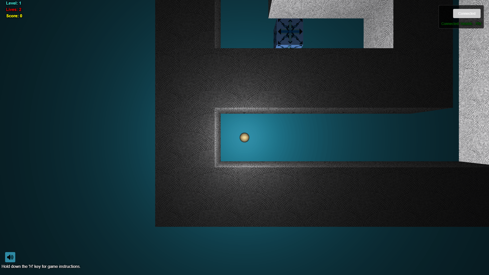

# 🚀 Ball-Maze with NFT Integration
# Hackhazards Monad Track #2 Winning Project 🏆

> Ball-Maze: Blockchain Gaming Reimagined

---

## 📌 Problem Statement

**Problem Statement 12 – Reimagine Gaming with Blockchain Technology**

---

## 🎯 Objective

This project transforms traditional gaming by integrating blockchain technology into a maze puzzle game, allowing players to mint NFTs based on their achievements. It serves gamers interested in Web3 and crypto-collectibles, providing a fun gaming experience with genuine digital ownership.

---

## 🧠 Team & Approach

### Team Name:  
`Team UnderRated`

### Team Members:  
- M Varshith ([Github](https://github.com/varshithm7x), [Linkedin](https://www.linkedin.com/in/mvarshith/), Role: Blockchain, Frontend, Lead)
- Anant Singh Tanwar (Frontend,Smart Contract Dev )  
- Karishma Mahapatra (Game Designer)  
- Hemanth Chapparam (UI/UX Designer)

### Your Approach:  
- We chose this problem to bridge the gap between traditional gaming and blockchain technology
- Key challenges included creating intuitive game mechanics while maintaining Web3 integration
- Our breakthrough came when implementing the NFT minting process based on game achievements

---

## 🛠️ Tech Stack

### Core Technologies Used:
- Frontend: HTML5, CSS3, JavaScript
- Game Engine: Box2D, Three.js
- Blockchain: Ethereum, Web3.js
- Smart Contracts: Solidity, Hardhat
- Libraries: OpenZeppelin

### Sponsor Technologies Used (if any):
- ✅ **Monad** _High-performance blockchain implementation for game transactions_
---

## ✨ Key Features

- ✅ Ball-Maze gameplay with multiple difficulty levels
- ✅ Web3 wallet integration (MetaMask)
- ✅ NFT minting based on game achievements




---

## 📽️ Demo & Deliverables

- **Demo Video Link:** [YouTube Demo](https://www.youtube.com/watch?v=Ns-U9e7OhHo&ab_channel=VOLT)  
- **Pitch Deck / PPT Link:** [Presentation PDF](https://docs.google.com/presentation/d/1kb_CKU0nrFFZHnY_Ahj5iA0LVzee9ob5/edit?usp=sharing&ouid=117155978787632386405&rtpof=true&sd=true)  

---

## ✅ Tasks & Bonus Checklist

- ✅ **All members of the team completed the mandatory task - Followed at least 2 of our social channels and filled the form**
- ✅ **All members of the team completed Bonus Task 1 - Sharing of Badges and filled the form (2 points)**
- ✅ **All members of the team completed Bonus Task 2 - Signing up for Sprint.dev and filled the form (3 points)**

---

## 🧪 How to Run the Project

### Requirements:
- Node.js v14+
- MetaMask browser extension
- Test MON on a supported network (for NFT minting)

### Local Setup:
```bash
# Clone the repo
git clone https://github.com/varshithm7x/Ball-Maze

# Install dependencies
cd Ball-Maze
npm install

# Configure environment
cp .env.sample .env
cp js/config.sample.js js/config.js
# Edit .env and js/config.js with your values

# Start development server
npm start
```

Open http://localhost:8080 in your browser with MetaMask installed.

---

## 🧬 Future Scope

- 📈 Multiplayer functionality with competitive gameplay
- 🛡️ Cross-chain NFT compatibility
- 🌐 Decentralized leaderboard system
- 🎮 Additional maze levels and game mechanics
- 💰 Marketplace for trading game-based NFTs

---

## 📎 Resources / Credits

- Box2D for physics engine
- Three.js for rendering
- OpenZeppelin for smart contract libraries
- Background music from freesound.org (Creative Commons)
- Cursor AI

---

## 🏁 Final Words

Creating this Ball-Maze game with NFT integration was an exciting journey that challenged us to blend traditional gaming mechanics with modern blockchain technology. We learned valuable lessons about Web3 user experience design and how to make blockchain interactions feel seamless within a gaming context.

---
